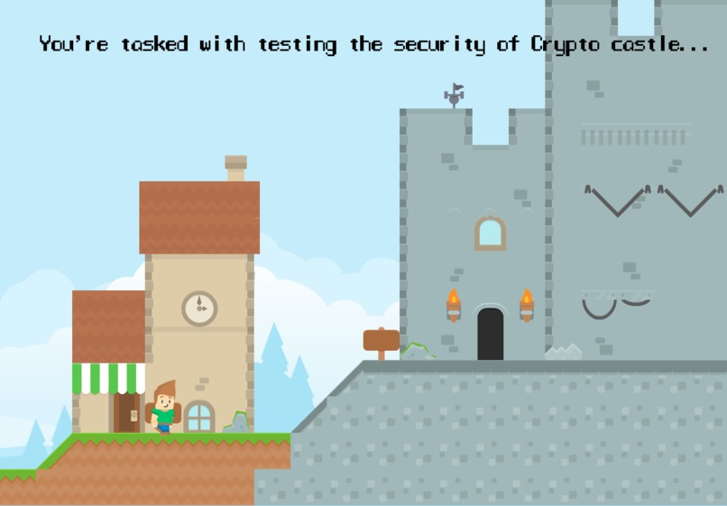

# Crypto Castle

The Avast challenge theme of security at Hack Cambridge 101 inspired us to come up with an addictive browser-based platformer game which teaches people about the different encryption algorithms that keep them safe whilst browsing the web!

We used MelonJS as a framework to make the game in Javascript. Tiled was used make the maps, GIMP to make some of the sprites, and open source sprites/music/sound effects to add the finishing touches. Check out our [Devpost](https://devpost.com/software/crypto-castle) for more info!

## Play the game

To build, be sure you have [node](http://nodejs.org) installed. Clone the project:

    git clone https://github.com/melonjs/boilerplate.git

Then in the cloned directory, simply run:

    npm install

You must also have `grunt-cli` installed globally:

    npm install -g grunt-cli

Running the game:

	grunt serve

And you will have the boilerplate example running on http://localhost:8000

## Building a release version

To build:

    grunt

This will create a `build` directory containing the files that can be uploaded to a server, or packaged into a mobile app.

----

Building a standalone desktop release:

    grunt dist

Running the desktop release on Windows:

    .\bin\electron.exe

Running the desktop release on macOS:

    open ./bin/Electron.app

Running the desktop release on Linux:

    ./bin/electron

Note that you may have to edit the file `Gruntfile.js` if you need to better dictate the order your files load in. Note how by default the game.js and resources.js are specified in a specific order.

-------------------------------------------------------------------------------
MelonJS
Copyright (C) 2011 - 2017 Olivier Biot
melonJS is licensed under the [MIT License](http://www.opensource.org/licenses/mit-license.php)
